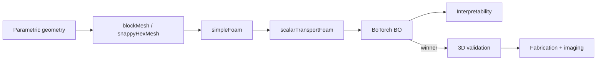

# tumor-chip-design

**Inverse design and interpretability for tumor-on-chip drug-gradient
chambers.**

`tumor-chip-design` is an open-source Python pipeline that combines:

- **Parametric CadQuery geometry** across three inlet topologies
  (`opposing`, `same_side_Y`, `asymmetric_lumen`).
- **OpenFOAM CFD** — `simpleFoam` momentum solve followed by
  `scalarTransportFoam` on the frozen velocity for a passive drug/tracer
  scalar.
- **BoTorch Bayesian optimisation** minimising an L² distance between the
  achieved concentration field and a user-specified target profile
  (`linear_gradient`, `bimodal`, `step`, or any callable).
- **Interpretability layer** — Sobol indices, exact GP-gradient local
  sensitivities, and bisection-on-GP tolerance intervals that report the
  fabrication tolerances labs need for each geometric parameter.

## Why this exists

The [manuscript](publications.md) argues that for passive, single-chip
tumor-on-chip devices (e.g. Ayuso-2020-style platforms), *the scientific
question is not "what geometry optimises a given target" but "which
geometric features actually matter, and by how much?"*  That latter question
is what this package answers — the BO is instrumental; the interpretability
output is the deliverable.

See [Inverse design](concepts/inverse-design.md) for the methodological
framing and [Interpretability](concepts/interpretability.md) for the Sobol
/ tolerance-interval details.

## Pipeline at a glance

The only thing that touches real CFD is the inner loop (B → C → D).
Everything else is pure Python.

## Getting started

- [Install](installation.md)
- [15-minute quickstart](quickstart.md) — reproduce a BO run + figures
  from a fresh clone using the Docker image.

## Citation

If you use this software, please cite via the `CITATION.cff` file or the
Zenodo DOI badge on the GitHub repository.

This is the companion software to the JOSS submission and the Lab on a
Chip manuscript; see [Publications](publications.md).
